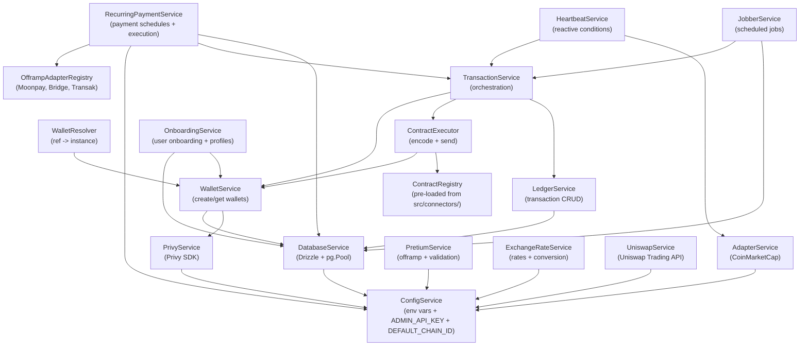
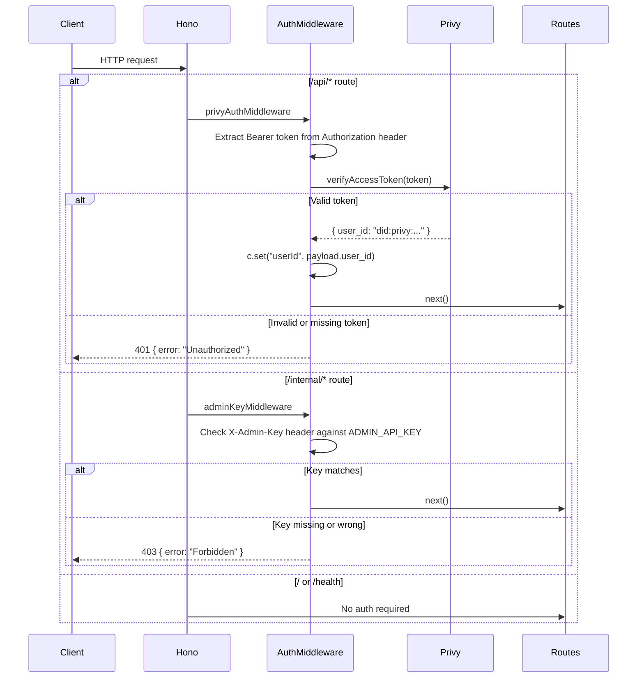
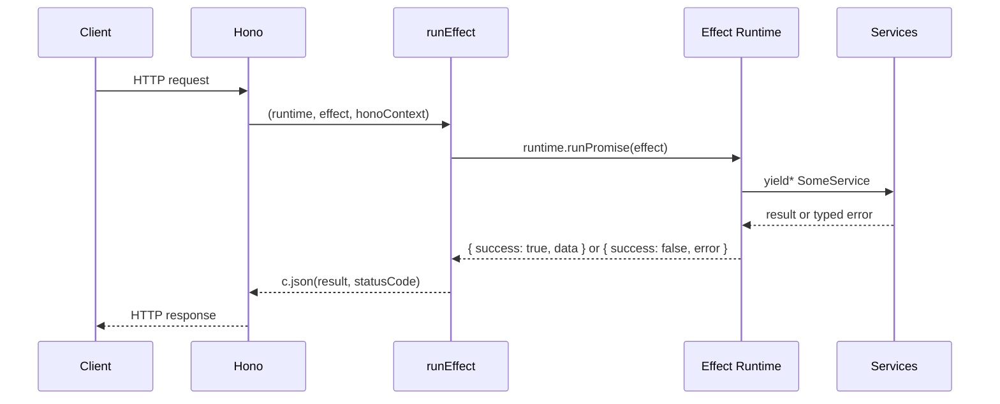
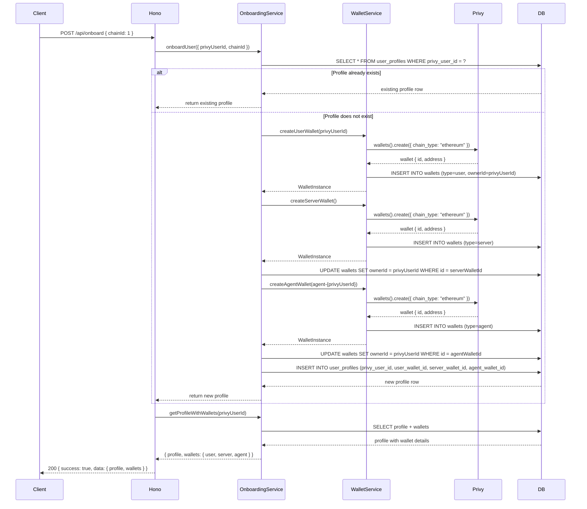
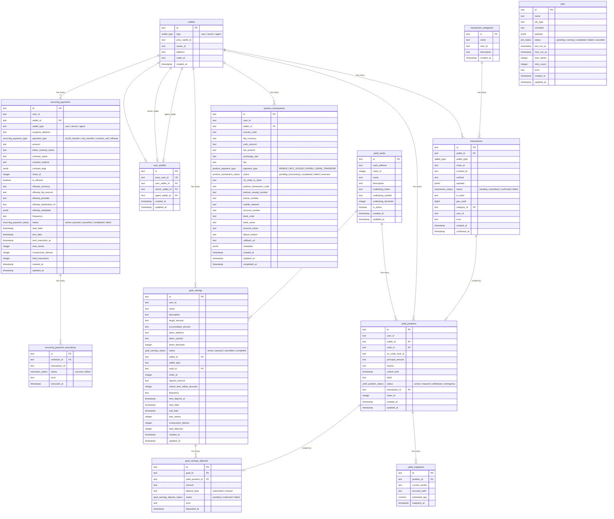

# Architecture Deep Dive

This document explains how Expendi is structured, how its Effect-TS layer system works, how HTTP routes bridge into Effect services, how authentication and authorization are enforced, and how errors and data flow through the system.

## Effect-TS Layer System

If you have not used Effect-TS before, here is the key mental model: every service in Expendi is defined as a **Context Tag** (a typed key for dependency injection) with a corresponding **Layer** (the implementation that satisfies it). Layers declare both what they provide and what they require. Effect composes these layers at startup into a single runtime that can resolve any service in the graph.

### Anatomy of a service

Every service follows the same three-part pattern:

```typescript
// 1. Define an interface for the service API
export interface LedgerServiceApi {
  readonly createIntent: (params: CreateIntentParams) => Effect.Effect<Transaction, LedgerError>;
  readonly markSubmitted: (id: string, txHash: Hash) => Effect.Effect<Transaction, LedgerError>;
  // ...
}

// 2. Create a Context Tag -- a typed key that the DI system uses to look up this service
export class LedgerService extends Context.Tag("LedgerService")<
  LedgerService,
  LedgerServiceApi
>() {}

// 3. Create a Layer -- the concrete implementation
// The type signature Layer.Layer<Provides, Error, Requires>
export const LedgerServiceLive: Layer.Layer<
  LedgerService,   // provides LedgerService
  never,           // never fails during construction
  DatabaseService  // requires DatabaseService
> = Layer.effect(
  LedgerService,
  Effect.gen(function* () {
    const { db } = yield* DatabaseService;  // pull in dependency
    return {
      createIntent: (params) => /* ... */,
      markSubmitted: (id, txHash) => /* ... */,
    };
  })
);
```

The `Layer.Layer<Provides, Error, Requires>` type is the core of the system:

- **Provides** -- what this layer makes available to the rest of the application.
- **Error** -- what can go wrong during layer construction (not during method calls).
- **Requires** -- what other services this layer needs to be built.

### Why layers matter

- **Type-safe DI** -- If a service method returns `Effect.Effect<Transaction, LedgerError>` and you try to run it without providing `LedgerService` in the runtime, you get a compile-time error, not a runtime crash.
- **Composability** -- Layers compose with `Layer.provide` and `Layer.mergeAll`. You can swap out any service implementation (for example, replacing `CoinMarketCapAdapterLive` with a test stub) without changing any consuming code.
- **Testability** -- In tests, you build a minimal layer stack with mock implementations and run effects against it, without needing the full dependency graph.

## Full Dependency Graph



Arrows point from a service to its dependency. For example, `WalletService` depends on both `PrivyService` and `DatabaseService`.

### Service descriptions

| Service | File | Purpose |
|---------|------|---------|
| `ConfigService` | `src/config.ts` | Reads `DATABASE_URL`, `PRIVY_APP_ID`, `PRIVY_APP_SECRET`, `COINMARKETCAP_API_KEY`, `ADMIN_API_KEY`, `DEFAULT_CHAIN_ID`, `PRETIUM_API_KEY`, `PRETIUM_BASE_URI`, `UNISWAP_API_KEY`, and `PORT` from environment variables using Effect's `Config` module. `DEFAULT_CHAIN_ID` defaults to `1` (Ethereum Mainnet) when not set. |
| `DatabaseService` | `src/db/client.ts` | Creates a `pg.Pool` and a Drizzle ORM instance bound to the full schema. Exposes `{ db, pool }`. |
| `PrivyService` | `src/services/wallet/privy-layer.ts` | Initializes the Privy Node SDK client. Exposes `{ client }`. |
| `WalletService` | `src/services/wallet/wallet-service-live.ts` | Creates wallets via Privy, persists them to the `wallets` table, and returns `WalletInstance` objects. Supports `createUserWallet`, `createServerWallet`, `createAgentWallet`, and `getWallet`. All three wallet types (user, server, agent) resolve sponsored transaction hashes by polling Privy's `transactions().get()` API via the `resolveTxHash` utility. |
| `WalletResolver` | `src/services/wallet/wallet-resolver.ts` | Takes a `WalletRef` (privy wallet ID + type) and resolves it to a `WalletInstance` by delegating to `WalletService.getWallet`. |
| `resolveTxHash` | `src/services/wallet/resolve-tx-hash.ts` | Utility that polls Privy's `transactions().get()` API to resolve the final on-chain transaction hash from a sponsored transaction. Used by all `WalletInstance` types (user, server, agent) after `sendTransaction` to obtain the actual hash that lands on-chain. |
| `ContractRegistry` | `src/services/contract/contract-registry.ts` | An in-memory `Map` storing `ContractConnector` objects keyed by `name:chainId`. Pre-loaded at startup with all connectors defined in `src/connectors/`. Supports `register`, `get`, `list`, and `remove`. |
| `ContractExecutor` | `src/services/contract/contract-executor.ts` | Encodes function data using viem's `encodeFunctionData`, then sends the transaction through a `WalletInstance`. Also supports read-only calls via a viem `PublicClient`. |
| `LedgerService` | `src/services/ledger/ledger-service.ts` | CRUD operations on the `transactions` table. Creates intents (pending), marks them submitted (with tx hash), confirmed (with gas), or failed (with error message). |
| `TransactionService` | `src/services/transaction/transaction-service.ts` | Orchestrates the full transaction lifecycle: create a ledger intent, execute the contract call or raw transfer, then update the ledger with the result. If execution fails, marks the intent as failed. |
| `AdapterService` | `src/services/adapters/adapter-service.ts` | Interface for external data sources. Current implementation: `CoinMarketCapAdapterLive` which fetches price data via the CoinMarketCap REST API. |
| `JobberService` | `src/services/jobber/jobber-service.ts` | Creates and manages recurring jobs stored in the `jobs` table. `processDueJobs` finds jobs whose `nextRunAt` is in the past, executes them (delegating to `TransactionService`), then reschedules. Supports retry with configurable `maxRetries`. |
| `HeartbeatService` | `src/services/heartbeat/heartbeat-service.ts` | Reactive condition monitoring. Conditions are stored in an in-memory `Ref<Map>`. Supports three condition types: `balance_threshold`, `price_trigger`, and `block_event`. When a condition triggers, it executes an action (currently: submit a raw transaction). |
| `OnboardingService` | `src/services/onboarding/onboarding-service.ts` | User onboarding and profile management. Creates a complete wallet set (user, server, agent) and a `user_profiles` record linking them. Provides `onboardUser` (idempotent), `getProfile`, `getProfileWithWallets`, and `isOnboarded`. |
| `RecurringPaymentService` | `src/services/recurring-payment/recurring-payment-service.ts` | Manages recurring payment schedules with configurable frequency, payment types (`erc20_transfer`, `raw_transfer`, `contract_call`, `offramp`), retry limits, and start/end dates. Provides `createSchedule`, `pauseSchedule`, `resumeSchedule`, `cancelSchedule`, `executeSchedule`, `processDuePayments`, and `getExecutionHistory`. Execution records are stored in `recurring_payment_executions`. Offramp payments delegate to the `OfframpAdapterRegistry` for provider-specific conversion logic. |
| `OfframpAdapterRegistry` | `src/services/offramp/offramp-registry.ts` | Resolves offramp provider adapters by name. Pre-registers adapters for Moonpay, Bridge, Transak, and Pretium at construction time. Each adapter implements the `OfframpAdapter` interface providing `initiateOfframp`, `getOfframpStatus`, `getDepositAddress`, `getSupportedCurrencies`, and `estimateOfframp`. |
| `PretiumService` | `src/services/pretium/pretium-service.ts` | Handles crypto-to-fiat disbursement via the Pretium API for 7 African countries (KE, NG, GH, UG, CD, MW, ET). Supports mobile money and bank transfers. Provides `disburse`, `getTransactionStatus`, `validatePhoneWithMno`, `validateBankAccount`, `getBanksForCountry`, and country/payment config lookups. The `buildDisburseRequestBody` function sends `mobile_network` for all Kenya payment types (MOBILE, BUY_GOODS, PAYBILL), uses `normalizeNetworkForValidation()` for network name resolution, and applies `Math.floor()` to amounts to ensure integer fiat values. |
| `ExchangeRateService` | `src/services/pretium/exchange-rate-service.ts` | Fetches live exchange rates from the Pretium API with 5-minute caching. Provides `getExchangeRate`, `convertUsdcToFiat`, `convertFiatToUsdc`, and `clearCache`. |
| `UniswapService` | `src/services/uniswap/uniswap-service.ts` | Wraps the [Uniswap Trading API](https://trade-api.gateway.uniswap.org/v1) for token swaps on Base (chain ID 8453). Provides `checkApproval`, `getQuote`, and `getSwapTransaction`. The service only handles HTTP communication with the Uniswap API -- route handlers in `src/routes/uniswap.ts` orchestrate the full swap flow by resolving wallet addresses from the database and submitting resulting transactions through `TransactionService.submitRawTransaction`. |
| `GoalSavingsService` | `src/services/goal-savings/goal-savings-service.ts` | Manages savings goals with target amounts, recurring automated deposits into yield pools, and progress tracking. Creates yield positions via YieldService on each deposit. Supports manual and automated deposits, pause/resume/cancel lifecycle, and automatic completion when accumulated amount reaches target. processDueDeposits polls for active goals with frequency set and nextDepositAt <= now. |

### Layer composition in MainLayer

The `src/layers/main.ts` file wires everything together. The pattern is to build each layer with its dependencies provided, then merge them all:

```typescript
const ConfigLayer = ConfigLive;
const DatabaseLayer = DatabaseLive.pipe(Layer.provide(ConfigLayer));
const PrivyLayer = PrivyLive.pipe(Layer.provide(ConfigLayer));

const WalletServiceLayer = WalletServiceLive.pipe(
  Layer.provide(PrivyLayer),
  Layer.provide(DatabaseLayer)
);

// ... each layer provides its dependencies ...

const OnboardingServiceLayer = OnboardingServiceLive.pipe(
  Layer.provide(WalletServiceLayer),
  Layer.provide(DatabaseLayer)
);

const OfframpRegistryLayer = OfframpAdapterRegistryLive;

const RecurringPaymentServiceLayer = RecurringPaymentServiceLive.pipe(
  Layer.provide(DatabaseLayer),
  Layer.provide(TransactionServiceLayer),
  Layer.provide(ConfigLayer),
  Layer.provide(OfframpRegistryLayer)
);

const PretiumServiceLayer = PretiumServiceLive.pipe(
  Layer.provide(ConfigLayer)
);

const ExchangeRateServiceLayer = ExchangeRateServiceLive.pipe(
  Layer.provide(ConfigLayer)
);

const UniswapServiceLayer = UniswapServiceLive.pipe(
  Layer.provide(ConfigLayer)
);

export const MainLayer = Layer.mergeAll(
  ConfigLayer,
  DatabaseLayer,
  PrivyLayer,
  WalletServiceLayer,
  WalletResolverLayer,
  ContractRegistryLayer,
  ContractExecutorLayer,
  LedgerServiceLayer,
  TransactionServiceLayer,
  AdapterServiceLayer,
  JobberServiceLayer,
  HeartbeatServiceLayer,
  OnboardingServiceLayer,
  RecurringPaymentServiceLayer,
  OfframpRegistryLayer,
  PretiumServiceLayer,
  ExchangeRateServiceLayer,
  UniswapServiceLayer
);
```

## Authentication and Authorization

Expendi uses a two-tier authentication model with middleware defined in `src/middleware/auth.ts`.

### Auth middleware architecture



### Public API authentication (Privy)

All `/api/*` routes are protected by `privyAuthMiddleware`. This middleware:

1. Reads the `Authorization: Bearer <token>` header from the request.
2. Verifies the token using `privyClient.utils().auth().verifyAccessToken(token)`.
3. Extracts the user's Privy DID (`did:privy:...`) and stores it in the Hono context as `userId`.
4. Returns `401 Unauthorized` if the token is missing, empty, or invalid.

The authenticated `userId` is then used by route handlers to enforce ownership. For example, `GET /api/wallets` only returns wallets where `ownerId = userId`. Transaction submission verifies that the caller owns the wallet being used.

### Internal API authentication (API key)

All `/internal/*` routes are protected by `adminKeyMiddleware`. This middleware:

1. Reads the `X-Admin-Key` header from the request.
2. Compares it to the `ADMIN_API_KEY` environment variable.
3. Returns `403 Forbidden` if the key is missing or does not match.

Internal routes have no user-scoping -- they can access all wallets, transactions, and jobs across all users.

### Route structure

```
GET /                        # No auth -- service info
GET /health                  # No auth -- health check

/api/*                       # Privy auth (Bearer token), user-scoped
  GET /api/wallets           # User's own wallets
  POST /api/wallets/user     # Create wallet (userId from auth context)
  GET /api/wallets/:id       # Ownership verified
  POST /api/wallets/:id/sign # Ownership verified
  GET /api/transactions      # User's own transactions
  GET /api/transactions/:id  # Ownership verified
  POST /api/transactions/contract  # Wallet ownership verified
  POST /api/transactions/raw       # Wallet ownership verified
  GET /api/categories        # Global + user's own categories
  GET /api/categories/:id    # Visible if global or owned
  POST /api/categories       # userId set from auth context
  PUT /api/categories/:id    # Ownership verified
  DELETE /api/categories/:id # Ownership verified
  POST /api/onboard          # Onboard user (idempotent, creates wallets + profile)
  GET /api/profile           # Get authenticated user's profile with wallets
  GET /api/profile/wallets   # Get just the wallet addresses
  GET /api/contracts         # Read-only, list registered connectors
  GET /api/contracts/:name/:chainId  # Read-only, get specific connector
  POST /api/contracts/read   # Read-only contract call
  GET /api/recurring-payments           # User's own recurring payment schedules
  GET /api/recurring-payments/:id       # Get schedule (ownership verified)
  POST /api/recurring-payments          # Create schedule (chainId optional, defaults from config)
  POST /api/recurring-payments/:id/pause   # Pause schedule (ownership verified)
  POST /api/recurring-payments/:id/resume  # Resume schedule (ownership verified)
  POST /api/recurring-payments/:id/cancel  # Cancel schedule (ownership verified)
  GET /api/recurring-payments/:id/executions  # Execution history (ownership verified)
  GET /api/pretium/countries              # Supported countries
  GET /api/pretium/countries/:code        # Country payment config
  GET /api/pretium/exchange-rate/:currency # Live exchange rate
  POST /api/pretium/convert/usdc-to-fiat  # Currency conversion
  POST /api/pretium/convert/fiat-to-usdc  # Currency conversion
  POST /api/pretium/validate/phone        # MNO name lookup
  POST /api/pretium/validate/bank-account # Bank account lookup
  GET /api/pretium/banks/:country         # Bank list (NG, KE)
  GET /api/pretium/settlement-address     # USDC deposit address
  POST /api/pretium/offramp               # Initiate offramp
  GET /api/pretium/offramp                # List user's offramps
  GET /api/pretium/offramp/:id            # Get offramp details
  POST /api/pretium/offramp/:id/refresh   # Poll for status update
  POST /api/uniswap/check-approval       # Check token approval for swap
  POST /api/uniswap/quote                # Get swap quote (no execution)
  POST /api/uniswap/swap                 # Execute full swap (approval + swap)

/webhooks/*                 # No auth -- payment provider callbacks
  POST /webhooks/pretium    # Pretium payment status callback

/internal/*                  # Admin key (X-Admin-Key header)
  GET /internal/wallets                    # All wallets (unfiltered)
  POST /internal/wallets/server            # Create server wallet
  POST /internal/wallets/agent             # Create agent wallet
  GET /internal/transactions               # All transactions (unfiltered)
  GET /internal/transactions/wallet/:walletId
  GET /internal/transactions/user/:userId
  PATCH /internal/transactions/:id/confirm
  PATCH /internal/transactions/:id/fail
  GET /internal/jobs
  POST /internal/jobs
  GET /internal/jobs/:id
  POST /internal/jobs/:id/cancel
  POST /internal/jobs/process
  GET /internal/profiles
  GET /internal/profiles/:privyUserId
  POST /internal/profiles/:privyUserId/onboard
  GET /internal/recurring-payments                  # All schedules (paginated)
  GET /internal/recurring-payments/:id              # Single schedule
  POST /internal/recurring-payments/:id/execute     # Force-execute a schedule
  GET /internal/recurring-payments/:id/executions   # Execution history
  POST /internal/recurring-payments/process         # Process all due payments
```

## How Hono Routes Bridge to Effect Services

The `runEffect` function in `src/routes/effect-handler.ts` is the bridge between the Hono request/response world and the Effect service world.

### The flow



### runEffect implementation

```typescript
export function runEffect<A, E>(
  runtime: AppRuntime,
  effect: Effect.Effect<A, E, NoInfer<AppDeps>>,
  c: HonoContext
): Promise<Response> {
  return runtime
    .runPromise(
      effect.pipe(
        Effect.map((data) => ({ success: true as const, data })),
        Effect.catchAll((error) =>
          Effect.succeed({
            success: false as const,
            error: {
              _tag: (error as { _tag?: string })?._tag ?? "UnknownError",
              message: String(error),
            },
          })
        )
      )
    )
    .then((result) => {
      if (result.success) {
        return c.json(result);       // 200
      }
      return c.json(result, 400);    // 400 for known errors
    })
    .catch((error) =>
      c.json(
        {
          success: false,
          error: { _tag: "InternalError", message: String(error) },
        },
        500                           // 500 for unexpected failures
      )
    );
}
```

Key points:

- **Success** returns `{ success: true, data: ... }` with HTTP 200.
- **Known errors** (any typed Effect error with a `_tag`) return `{ success: false, error: { _tag, message } }` with HTTP 400.
- **Unexpected errors** (unhandled exceptions, runtime crashes) return HTTP 500 with `_tag: "InternalError"`.

### Route handler pattern

Every route handler follows the same pattern:

```typescript
app.post("/some-action", (c) =>
  runEffect(
    runtime,
    Effect.gen(function* () {
      // 1. Parse request body
      const body = yield* Effect.tryPromise({
        try: () => c.req.json<{ someField: string }>(),
        catch: () => new Error("Invalid request body"),
      });

      // 2. Pull in services from the runtime
      const someService = yield* SomeService;

      // 3. Call service methods (typed errors propagate automatically)
      const result = yield* someService.doSomething(body.someField);

      // 4. Return data (runEffect wraps it in { success: true, data: ... })
      return result;
    }),
    c
  )
);
```

The `runtime` parameter is a `ManagedRuntime` exported from `src/runtime.ts`:

```typescript
import { ManagedRuntime } from "effect";
import { MainLayer } from "./layers/main.js";

export const runtime = ManagedRuntime.make(MainLayer);
```

This runtime is shared across both the Hono route handlers and the Trigger.dev scheduled tasks. It initializes all services (database connections, Privy client, etc.) lazily on first use and keeps them alive for the lifetime of the process. See [Scheduled Tasks (Trigger.dev)](#scheduled-tasks-triggerdev) for how the same runtime is reused by background task workers.

## Contract Connector System

Contracts are no longer registered via API endpoints. Instead, connectors are defined in TypeScript files under `src/connectors/` and pre-loaded into the `ContractRegistry` at startup.

The `ContractRegistryLive` layer accepts an array of `ContractConnector` objects and registers them all when the layer is constructed. See [Adding Contracts](./guides/adding-contracts.md) for the full guide.

### Multi-chain connector definitions

Connectors that are deployed on multiple chains use the `MultiChainConnectorDef` type and the `expandMultiChain` helper instead of manually defining each chain entry. This reduces duplication and keeps address lists in a single place:

```typescript
import { expandMultiChain } from "../services/contract/types.js";

export const erc20Connectors = [
  ...expandMultiChain({
    name: "usdc",
    addresses: {
      1: "0xA0b86991c6218b36c1d19D4a2e9Eb0cE3606eB48",    // Ethereum Mainnet
      137: "0x3c499c542cEF5E3811e1192ce70d8cC03d5c3359",  // Polygon PoS
      42161: "0xaf88d065e77c8cC2239327C5EDb3A432268e5831", // Arbitrum One
      10: "0x0b2C639c533813f4Aa9D7837CAf62653d097Ff85",    // Optimism
      8453: "0x833589fCD6eDb6E08f4c7C32D4f71b54bdA02913",  // Base
    },
    abi: ERC20_ABI,
    methods: erc20Methods,
  }),
];
```

The `expandMultiChain` function produces one `ContractConnector` per entry in the `addresses` map, each with the correct `chainId` set. See [Adding Contracts](./guides/adding-contracts.md) for the full guide.

Pre-loaded connectors:

| File | Connectors |
|------|------------|
| `src/connectors/erc20.ts` | USDC (Ethereum, Polygon, Arbitrum, Optimism, Base), USDT (Ethereum, Polygon, Arbitrum, Optimism) |
| `src/connectors/erc721.ts` | BAYC (Ethereum) |

## Error Handling Strategy

Expendi uses Effect's typed error system. Every service defines its own error class using `Data.TaggedError`:

```typescript
export class WalletError extends Data.TaggedError("WalletError")<{
  readonly message: string;
  readonly cause?: unknown;
}> {}

export class ContractExecutionError extends Data.TaggedError("ContractExecutionError")<{
  readonly message: string;
  readonly cause?: unknown;
}> {}

export class LedgerError extends Data.TaggedError("LedgerError")<{
  readonly message: string;
  readonly cause?: unknown;
}> {}

export class ContractNotFoundError extends Data.TaggedError("ContractNotFoundError")<{
  readonly name: string;
  readonly chainId: number;
}> {}

export class OnboardingError extends Data.TaggedError("OnboardingError")<{
  readonly message: string;
  readonly cause?: unknown;
}> {}

export class RecurringPaymentError extends Data.TaggedError("RecurringPaymentError")<{
  readonly message: string;
  readonly cause?: unknown;
}> {}

export class OfframpError extends Data.TaggedError("OfframpError")<{
  readonly message: string;
  readonly provider: string;
  readonly cause?: unknown;
}> {}

export class UniswapError extends Data.TaggedError("UniswapError")<{
  readonly message: string;
  readonly cause?: unknown;
}> {}
```

### Error propagation

Errors propagate through the Effect pipeline. A method signature like:

```typescript
readonly submitContractTransaction: (
  params: SubmitContractTxParams
) => Effect.Effect<
  Transaction,
  TransactionError | LedgerError | ContractExecutionError | ContractNotFoundError | WalletError
>;
```

...tells you exactly which errors can occur. The compiler enforces this -- you cannot accidentally ignore an error channel.

### Error recovery patterns

The codebase uses several error recovery patterns:

**Tap and ignore** -- Log or side-effect on error without changing the error channel:

```typescript
executor.execute(request, walletId, walletType).pipe(
  Effect.tapError((error) =>
    ledger.markFailed(intent.id, String(error)).pipe(Effect.ignore)
  )
);
```

**catchAll with fallback** -- Swallow errors and return a default:

```typescript
checkBalanceThreshold(condition).pipe(
  Effect.catchAll(() => Effect.succeed(false))
);
```

**mapError** -- Convert one error type to another:

```typescript
txService.submitRawTransaction(params).pipe(
  Effect.mapError((e) => new HeartbeatError({ message: String(e), cause: e }))
);
```

### How errors reach the HTTP client

All typed errors are caught by `runEffect`'s `Effect.catchAll`, which extracts the `_tag` and `message` and returns them as a JSON body with HTTP 400. The client always receives a consistent error shape:

```json
{
  "success": false,
  "error": {
    "_tag": "WalletError",
    "message": "Failed to create user wallet: ..."
  }
}
```

Authentication errors are handled by the middleware before reaching the Effect layer:

- Missing or invalid Privy token: `401 { "error": "Unauthorized" }`
- Missing or invalid admin key: `403 { "error": "Forbidden" }`

## Onboarding Flow

The onboarding system creates a complete wallet set and profile for a user in a single idempotent operation. Here is the sequence of operations when `POST /api/onboard` is called:



The operation is idempotent: if the user already has a profile, the existing profile is returned without creating duplicate wallets. All three wallets are assigned `ownerId = privyUserId` so ownership verification works consistently across the transaction API.

## Admin Dashboard Architecture

The admin dashboard is a Next.js application located in the `admin/` directory. It provides a web interface for backend administration.

### Technology stack

- **Next.js** -- React framework with App Router
- **shadcn/ui** -- Component library built on Radix UI primitives
- **Tailwind CSS** -- Utility-first CSS with dark mode support
- **TypeScript** -- Full type safety

### Communication with the backend

The admin dashboard communicates exclusively through the `/internal/*` API routes. An API client in `admin/src/lib/api.ts` handles all HTTP requests, automatically including the `X-Admin-Key` header from the configuration.

### Pages

| Page | Route | Backend Routes Used |
|------|-------|-------------------|
| Dashboard | `/` | Multiple `/internal/*` endpoints for stats |
| Wallets | `/wallets` | `GET /internal/wallets`, `POST /internal/wallets/server`, `POST /internal/wallets/agent` |
| Transactions | `/transactions` | `GET /internal/transactions`, `PATCH /internal/transactions/:id/confirm`, `PATCH /internal/transactions/:id/fail` |
| Jobs | `/jobs` | `GET /internal/jobs`, `POST /internal/jobs`, `POST /internal/jobs/:id/cancel`, `POST /internal/jobs/process` |
| Recurring Payments | `/recurring-payments` | `GET /internal/recurring-payments`, `GET /internal/recurring-payments/:id`, `POST /internal/recurring-payments/:id/execute`, `GET /internal/recurring-payments/:id/executions`, `POST /internal/recurring-payments/process` |
| Contracts | `/contracts` | `GET /api/contracts` (read-only, no auth needed for display) |
| Categories | `/categories` | Uses internal endpoints for category management |
| Profiles | `/profiles` | `GET /internal/profiles`, `GET /internal/profiles/:privyUserId`, `POST /internal/profiles/:privyUserId/onboard` |
| Impersonate | `/impersonate` | Queries user-specific data via `/internal/transactions/user/:userId`, `GET /internal/profiles/:privyUserId` |

## Scheduled Tasks (Trigger.dev)

Expendi uses [Trigger.dev](https://trigger.dev) to run automated scheduled jobs. Three processing pipelines that previously required manual HTTP calls to internal admin endpoints now run automatically on cron schedules.

### Shared runtime

The `ManagedRuntime` instance in `src/runtime.ts` is the single entry point for running Effect programs. Both the Hono HTTP server (`src/index.ts`) and the Trigger.dev task workers (`trigger/*.ts`) import the same module:

```
src/runtime.ts          <-- shared ManagedRuntime (MainLayer)
  |
  +-- src/index.ts      <-- Hono server imports runtime for route handlers
  |
  +-- trigger/*.ts      <-- Trigger.dev tasks import runtime for scheduled work
```

Each Trigger.dev task worker process creates its own runtime instance when it boots, giving it full access to `DatabaseService`, `TransactionService`, `JobberService`, `RecurringPaymentService`, `YieldService`, and every other service in the dependency graph. There is no HTTP roundtrip between the task worker and the Hono server -- the task runs the Effect program directly against the database.

### Scheduled tasks

| Task file | Task ID | Cron schedule | Service call | Description |
|-----------|---------|---------------|--------------|-------------|
| `trigger/process-due-jobs.ts` | `process-due-jobs` | `* * * * *` (every minute) | `JobberService.processDueJobs()` | Finds jobs with `status = "pending"` and `nextRunAt <= now`, executes them via `TransactionService`, then reschedules. |
| `trigger/process-due-payments.ts` | `process-due-payments` | `*/5 * * * *` (every 5 minutes) | `RecurringPaymentService.processDuePayments()` | Finds active recurring payment schedules with `nextExecutionAt <= now`, executes each one, records the result, and reschedules. |
| `trigger/snapshot-yield.ts` | `snapshot-yield-positions` | `0 * * * *` (every hour, on the hour) | `YieldService.snapshotAllActivePositions()` | Reads accrued yield from on-chain for all active positions, calculates APY, and stores yield snapshots. |
| `trigger/process-due-goal-deposits.ts` | `process-due-goal-deposits` | `*/5 * * * *` (every 5 minutes) | `GoalSavingsService.processDueDeposits()` | Finds active goals with frequency and nextDepositAt <= now, creates yield positions, updates accumulation, pauses on consecutive failures. |

Each task follows the same pattern:

```typescript
import { schedules } from "@trigger.dev/sdk";
import { Effect } from "effect";
import { runtime } from "../src/runtime.js";
import { SomeService } from "../src/services/some/some-service.js";

export const myTask = schedules.task({
  id: "my-task-id",
  cron: "*/5 * * * *",
  run: async (payload) => {
    const result = await runtime.runPromise(
      Effect.gen(function* () {
        const service = yield* SomeService;
        return yield* service.someMethod();
      })
    );
    return { count: result.length, timestamp: payload.timestamp };
  },
});
```

### Manual fallback endpoints

The internal admin endpoints that these tasks automate still exist and can be called manually for debugging, one-off processing, or when Trigger.dev is unavailable:

| Scheduled task | Manual endpoint |
|----------------|----------------|
| `process-due-jobs` | `POST /internal/jobs/process` |
| `process-due-payments` | `POST /internal/recurring-payments/process` |
| `snapshot-yield-positions` | `POST /internal/yield/snapshots/run` |
| `process-due-goal-deposits` | `POST /internal/goal-savings/process` |

### Directory structure

```
trigger/
  process-due-jobs.ts        # Cron: every 1 minute
  process-due-payments.ts    # Cron: every 5 minutes
  snapshot-yield.ts          # Cron: every hour

trigger.config.ts            # Trigger.dev project configuration
```

The `trigger.config.ts` at the project root configures the Trigger.dev project reference, task directories, runtime, and maximum task duration (300 seconds):

```typescript
import { defineConfig } from "@trigger.dev/sdk";

export default defineConfig({
  project: process.env.TRIGGER_PROJECT_REF ?? "your-project-ref",
  dirs: ["./trigger"],
  runtime: "node",
  maxDuration: 300,
});
```

### Environment variables

Two additional environment variables are required for Trigger.dev:

| Variable | Description |
|----------|-------------|
| `TRIGGER_SECRET_KEY` | API key from the Trigger.dev dashboard. Used by the SDK to authenticate with the Trigger.dev platform. |
| `TRIGGER_PROJECT_REF` | Project reference from the Trigger.dev dashboard. Identifies which project the tasks belong to. |

### Running locally

Run the Trigger.dev dev server alongside the Hono backend:

```bash
# Terminal 1 -- Hono backend
pnpm dev

# Terminal 2 -- Trigger.dev task runner (connects to Trigger.dev cloud, executes tasks locally)
pnpm trigger:dev
```

The `trigger:dev` command starts a local task worker that registers the scheduled tasks with Trigger.dev and executes them on the configured cron schedules. Both processes share the same `src/runtime.ts` module, so they use identical service implementations and connect to the same database.

To deploy tasks to the Trigger.dev cloud for production:

```bash
pnpm trigger:deploy
```

## Database Schema

Expendi uses Drizzle ORM with PostgreSQL. The schema is defined in `src/db/schema/` using Drizzle's TypeScript-first approach.

### Entity Relationship Diagram



### Enums

Eleven PostgreSQL enums are defined in `src/db/schema/enums.ts`:

| Enum | Values |
|------|--------|
| `wallet_type` | `user`, `server`, `agent` |
| `transaction_status` | `pending`, `submitted`, `confirmed`, `failed` |
| `job_status` | `pending`, `running`, `completed`, `failed`, `cancelled` |
| `recurring_payment_status` | `active`, `paused`, `cancelled`, `completed`, `failed` |
| `recurring_payment_type` | `erc20_transfer`, `raw_transfer`, `contract_call`, `offramp` |
| `execution_status` | `success`, `failed` |
| `pretium_transaction_status` | `pending`, `processing`, `completed`, `failed`, `reversed` |
| `pretium_payment_type` | `MOBILE`, `BUY_GOODS`, `PAYBILL`, `BANK_TRANSFER` |
| `yield_position_status` | `active`, `matured`, `withdrawn`, `emergency` |
| `goal_savings_status` | `active`, `paused`, `cancelled`, `completed` |
| `goal_savings_deposit_status` | `pending`, `confirmed`, `failed` |

### Table details

**wallets** -- Every wallet created through Privy gets a row here. The `privy_wallet_id` is the Privy-side identifier; `owner_id` is the user/agent ID that owns it, or `"system"` for server wallets. `address` is the Ethereum address (populated at creation time).

**transactions** -- The core ledger table. A transaction starts as `pending` (intent created), moves to `submitted` (tx hash received), then either `confirmed` (on-chain confirmation) or `failed`. The `payload` column is JSONB storing the original call arguments. `contract_id` holds the contract name for contract transactions, or is null for raw transfers. `method` is either a contract method name or `"raw_transfer"`. The `user_id` column tracks which user initiated the transaction.

**transaction_categories** -- User-defined labels for organizing transactions. A category can be scoped to a specific user (`user_id`) or global (null `user_id`). In the public API, categories are scoped to the authenticated user.

**user_profiles** -- Links a Privy user to their three wallets. The `privy_user_id` column has a unique constraint, enforcing one profile per user. The three wallet FK columns (`user_wallet_id`, `server_wallet_id`, `agent_wallet_id`) each reference the `wallets.id` column. This table is populated by the `OnboardingService.onboardUser` method and serves as the canonical mapping from a user identity to their wallet set.

**jobs** -- Recurring scheduled work. The `schedule` field uses a simple duration format (`30s`, `5m`, `1h`, `1d`). `job_type` determines what the job does: `"contract_transaction"` or `"raw_transaction"`. The `payload` JSONB column contains all the parameters needed to construct the transaction. `next_run_at` determines when the job is next eligible for processing. Jobs are managed exclusively through the `/internal/*` admin routes.

**recurring_payments** -- User-facing recurring payment schedules. Each record defines a payment type (`erc20_transfer`, `raw_transfer`, `contract_call`, or `offramp`), amount, recipient, wallet, chain, and frequency. The `frequency` field uses the same duration format as jobs (`5m`, `1h`, `1d`, `7d`). Active schedules are processed by `RecurringPaymentService.processDuePayments`, which finds schedules with `status = "active"` and `next_execution_at <= now()`, executes each one, and reschedules. If a schedule accumulates more consecutive failures than `max_retries`, it is automatically paused. Offramp-specific fields (`is_offramp`, `offramp_currency`, `offramp_fiat_amount`, `offramp_provider`, `offramp_destination_id`, `offramp_metadata`) are populated when `payment_type = "offramp"` and store the provider configuration for fiat off-ramp conversions.

**recurring_payment_executions** -- Execution log for recurring payments. Each row records a single execution attempt, linking back to the `recurring_payments` schedule and optionally to a `transactions` record. The `status` column is either `"success"` or `"failed"`, and the `error` column stores the failure message when applicable.

**pretium_transactions** -- Records crypto-to-fiat offramp disbursements via the Pretium API. Each row tracks a single offramp: the USDC amount sent, the fiat amount disbursed, the exchange rate at the time, the recipient details (phone number for mobile money, or bank account for bank transfers), and the current status from Pretium. The `on_chain_tx_hash` column stores the transaction hash of the USDC transfer to the settlement address. The `pretium_transaction_code` and `pretium_receipt_number` columns are populated as the disbursement progresses through Pretium's pipeline. The `wallet_id` references the wallet used to send USDC.

**yield_vaults** -- Represents on-chain yield vaults where users can deposit tokens. Each vault has an on-chain contract address, a chain ID, a human-readable name, and metadata about the underlying token (address, symbol, decimals). The `is_active` flag controls whether the vault accepts new deposits. Vaults are managed through the internal admin API and can be synced from on-chain data.

**yield_positions** -- Represents a user's deposit into a yield vault. Created when a user locks tokens via the YieldTimeLock contract. The `on_chain_lock_id` stores the lock identifier returned by the contract. The `principal_amount` and `shares` track the original deposit. The `unlock_time` determines when the lock expires and the position can be withdrawn. Status progresses from `active` to `matured` (when unlock time passes) to `withdrawn` (after successful withdrawal). The `emergency` status is reserved for forced unlocks.

**yield_snapshots** -- Periodic snapshots of yield accrual for each active position. Created hourly by the `snapshot-yield-positions` scheduled task. Each snapshot records the current total assets, accrued yield since deposit, and an estimated annualized percentage yield (APY). Used to render yield history charts and portfolio summaries.

**goal_savings** -- Savings goals with target amounts. Users define a name, target amount, and token details. Optional automation fields (walletId, vaultId, depositAmount, frequency) enable recurring deposits into yield pools. When accumulatedAmount reaches targetAmount, the goal is marked completed. The consecutiveFailures counter tracks failed automated deposits; when it reaches maxRetries the goal is paused.

**goal_savings_deposits** -- Individual deposit records linking a goal to a yield position. Each deposit records the amount, type (automated or manual), status, and optional error message. The yieldPositionId references the yield position created by YieldService.createPosition.

### Migrations

Drizzle Kit generates and applies migrations:

```bash
pnpm db:generate   # reads src/db/schema/* and outputs SQL to ./drizzle/
pnpm db:migrate    # applies pending migrations to the DATABASE_URL database
```

The `drizzle.config.ts` at the project root configures the schema source and migration output directory.

## Supported Chains

The `ContractExecutor` and `HeartbeatService` both maintain a chain map for viem `PublicClient` creation:

| Chain ID | Network |
|----------|---------|
| 1 | Ethereum Mainnet |
| 11155111 | Sepolia (testnet) |
| 137 | Polygon |
| 42161 | Arbitrum |
| 10 | Optimism |
| 8453 | Base |

If an unrecognized chain ID is passed, the system falls back to Ethereum Mainnet.
