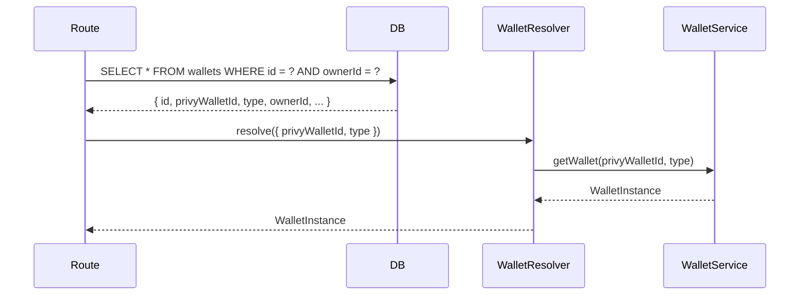

# Working with Wallets

Expendi provides a unified wallet abstraction over [Privy](https://www.privy.io/) server-side wallets. All wallet types share the same `WalletInstance` interface for getting addresses, signing messages, and sending transactions -- the caller does not need to know the wallet type to use it.

## Recommended: Use the Onboarding Flow

The **recommended way** to set up wallets for a user is through the onboarding system. A single call to `POST /api/onboard` creates all three wallet types (user, server, agent) and links them in a `user_profiles` record. This is idempotent -- calling it again for the same user returns the existing profile.

```bash
curl -X POST http://localhost:3000/api/onboard \
  -H "Authorization: Bearer YOUR_PRIVY_TOKEN" \
  -H "Content-Type: application/json" \
  -d '{ "chainId": 1 }'
```

After onboarding, you can look up a user's wallets by type:

```bash
curl http://localhost:3000/api/profile/wallets \
  -H "Authorization: Bearer YOUR_PRIVY_TOKEN"
```

```json
{
  "success": true,
  "data": {
    "user": "0x1234...abcd",
    "server": "0x5678...efgh",
    "agent": "0x9abc...ijkl"
  }
}
```

The `user_profiles` table is the canonical reference for finding a user's wallets:

| Column | Type | Description |
|--------|------|-------------|
| `id` | text (PK) | Profile UUID |
| `privy_user_id` | text (unique) | The user's Privy DID |
| `user_wallet_id` | text (FK -> wallets.id) | The user's personal wallet |
| `server_wallet_id` | text (FK -> wallets.id) | Backend-controlled wallet assigned to this user |
| `agent_wallet_id` | text (FK -> wallets.id) | Agent wallet assigned to this user |
| `created_at` | timestamp | When the profile was created |
| `updated_at` | timestamp | Last update time |

Admins can also trigger onboarding for a specific user without their auth token:

```bash
curl -X POST http://localhost:3000/internal/profiles/did:privy:cm3x9kf2a00cl14mhbz6t7s92/onboard \
  -H "X-Admin-Key: YOUR_ADMIN_API_KEY" \
  -H "Content-Type: application/json" \
  -d '{ "chainId": 1 }'
```

See the [Onboarding Guide](./onboarding.md) for the complete flow and integration examples.

The individual wallet creation endpoints described below are still available for cases where you need to create wallets outside of the onboarding flow (for example, creating additional server wallets for treasury management or standalone agent wallets).

## Wallet Types

| Type | Owner | Use Case | Created Via |
|------|-------|----------|-------------|
| `user` | A human end-user, identified by their Privy DID | End-user wallets controlled through your application | Public API (`POST /api/wallets/user`) |
| `server` | The system itself (owner is always `"system"`) | Backend-controlled wallets for treasury, fees, or automated operations | Internal API (`POST /internal/wallets/server`) |
| `agent` | An AI agent, identified by an `agentId` string | Wallets assigned to autonomous agents for on-chain actions | Internal API (`POST /internal/wallets/agent`) |

All three types are Ethereum wallets created through Privy's `wallets().create({ chain_type: "ethereum" })` API. The distinction is purely logical and tracked in the `wallets` database table via the `type` and `owner_id` columns.

## Authentication Requirements

Wallet operations are split across two route groups with different authentication:

- **Public API (`/api/wallets`)** -- Requires a Privy access token via the `Authorization: Bearer <token>` header. Users can only see and use their own wallets. The `userId` is extracted from the verified token, not from the request body.
- **Internal API (`/internal/wallets`)** -- Requires the `X-Admin-Key` header. Used for creating server and agent wallets, and for listing all wallets across all users.

## The WalletInstance Interface

Every wallet, regardless of type, exposes the same three operations:

```typescript
// src/services/wallet/wallet-service.ts

export interface WalletInstance {
  readonly getAddress: () => Effect.Effect<`0x${string}`, WalletError>;
  readonly sign: (message: string) => Effect.Effect<`0x${string}`, WalletError>;
  readonly sendTransaction: (
    tx: SendTransactionParams
  ) => Effect.Effect<Hash, WalletError>;
}

export interface SendTransactionParams {
  readonly to: string;
  readonly value?: bigint;
  readonly data?: string;
  readonly chainId: number;
  readonly sponsor?: boolean; // defaults to true -- gas-sponsored via Privy smart accounts
}
```

- **`getAddress()`** -- Fetches the wallet's Ethereum address from Privy.
- **`sign(message)`** -- Signs a message using `personal_sign` (EIP-191).
- **`sendTransaction(tx)`** -- Sends an on-chain transaction via `privy.wallets().ethereum().sendTransaction()`. The `chainId` is passed as a CAIP-2 identifier (`eip155:{chainId}`). Transactions are gas-sponsored by default (`sponsor: true`) through Privy's smart account system. Sponsored transactions do not return an on-chain hash immediately -- the wallet automatically polls Privy's `transactions().get()` API (via the shared `resolveTransactionHash` utility in `src/services/wallet/resolve-tx-hash.ts`) to resolve the `transaction_id` to an actual on-chain `transaction_hash` before returning. Non-sponsored transactions return the hash directly.

## How Wallet Creation Works

The primary wallet creation path is through **onboarding** (`POST /api/onboard`), which creates all three wallet types in one operation and records the mapping in the `user_profiles` table. For cases where you need individual wallet creation, the flow is as follows.

When you create a wallet through the API, two things happen:

1. **Privy wallet creation** -- A new Ethereum wallet is created on Privy's infrastructure via `privy.wallets().create({ chain_type: "ethereum" })`.
2. **Database persistence** -- A row is inserted into the `wallets` table with the Privy wallet ID, wallet type, owner ID, and Ethereum address.

The wallet creation flow inside `WalletServiceLive`:

```typescript
createUserWallet: (userId: string) =>
  Effect.gen(function* () {
    // 1. Create wallet on Privy
    const wallet = yield* Effect.tryPromise({
      try: () => privy.wallets().create({ chain_type: "ethereum" }),
      catch: (error) =>
        new WalletError({ message: `Failed to create user wallet: ${error}`, cause: error }),
    });

    // 2. Persist to database
    yield* Effect.tryPromise({
      try: () =>
        db.insert(wallets).values({
          type: "user",
          privyWalletId: wallet.id,
          ownerId: userId,
          address: wallet.address,
        }),
      catch: (error) =>
        new WalletError({ message: `Failed to persist user wallet: ${error}`, cause: error }),
    });

    // 3. Return a WalletInstance
    return createUserWalletInstance(privy, wallet.id);
  }),
```

Server wallets use `"system"` as the `ownerId`. Agent wallets use the `agentId`.

## Creating Wallets via the API

### Create a user wallet (Public API -- Privy auth required)

User wallets are created through the public API. The `userId` is automatically extracted from the authenticated Privy token -- you do not pass it in the request body:

```bash
curl -X POST http://localhost:3000/api/wallets/user \
  -H "Authorization: Bearer YOUR_PRIVY_TOKEN" \
  -H "Content-Type: application/json"
```

Response:

```json
{
  "success": true,
  "data": {
    "address": "0x1234...abcd",
    "type": "user"
  }
}
```

### Create a server wallet (Internal API -- admin key required)

Server wallets are created through the internal admin API:

```bash
curl -X POST http://localhost:3000/internal/wallets/server \
  -H "X-Admin-Key: YOUR_ADMIN_API_KEY"
```

Response:

```json
{
  "success": true,
  "data": {
    "address": "0x5678...efgh",
    "type": "server"
  }
}
```

### Create an agent wallet (Internal API -- admin key required)

Agent wallets are also created through the internal admin API:

```bash
curl -X POST http://localhost:3000/internal/wallets/agent \
  -H "X-Admin-Key: YOUR_ADMIN_API_KEY" \
  -H "Content-Type: application/json" \
  -d '{ "agentId": "agent-001" }'
```

Response:

```json
{
  "success": true,
  "data": {
    "address": "0x9abc...ijkl",
    "type": "agent"
  }
}
```

## How Wallet Resolution Works

When you need to use an existing wallet (for signing or sending transactions), you need to go from a database record back to a `WalletInstance`. This is what the `WalletResolver` service does.

### The resolution flow



Note that the public API routes always verify ownership by checking `ownerId = userId` (from the auth context) before resolving the wallet.

The `WalletResolver` is a thin wrapper around `WalletService.getWallet`:

```typescript
// src/services/wallet/wallet-resolver.ts

export interface WalletRef {
  readonly privyWalletId: string;
  readonly type: "user" | "server" | "agent";
}

export interface WalletResolverApi {
  readonly resolve: (ref: WalletRef) => Effect.Effect<WalletInstance, WalletError>;
}
```

For user and server wallets, `getWallet` creates a `WalletInstance` directly from the Privy wallet ID. For agent wallets, it first looks up the `ownerId` from the database (since the agent wallet instance factory needs the agent ID).

## Signing Messages

Signing is available through the public API and requires ownership verification:

```bash
curl -X POST http://localhost:3000/api/wallets/{wallet-db-id}/sign \
  -H "Authorization: Bearer YOUR_PRIVY_TOKEN" \
  -H "Content-Type: application/json" \
  -d '{ "message": "Hello, Expendi!" }'
```

Response:

```json
{
  "success": true,
  "data": {
    "signature": "0xabc123..."
  }
}
```

The sign endpoint:

1. Looks up the wallet record in the database by its ID and verifies the authenticated user owns it.
2. Uses `WalletResolver` to get a `WalletInstance`.
3. Calls `wallet.sign(message)`, which uses Privy's `personal_sign` RPC method.

If the wallet does not exist or is not owned by the authenticated user, the endpoint returns an error.

## Sending Transactions

Wallets are used for transactions in two ways:

### Via the transactions API (recommended)

The `POST /api/transactions/contract` and `POST /api/transactions/raw` endpoints handle the full lifecycle: creating a ledger intent, executing the transaction, and tracking the result. Both endpoints require Privy authentication and verify that the authenticated user owns the specified wallet.

**Using `walletType` instead of `walletId`:** If the user has been onboarded, you can pass `walletType` (`"user"`, `"server"`, or `"agent"`) instead of `walletId`. The system resolves the correct wallet from the `user_profiles` table. This is the simplest way to submit transactions after onboarding:

```bash
curl -X POST http://localhost:3000/api/transactions/raw \
  -H "Authorization: Bearer YOUR_PRIVY_TOKEN" \
  -H "Content-Type: application/json" \
  -d '{
    "walletType": "server",
    "chainId": 1,
    "to": "0xRecipientAddress",
    "value": "1000000000000000000"
  }'
```

If both `walletId` and `walletType` are provided, `walletId` takes precedence. See the [API Reference](../api-reference.md) for full details.

### How sponsored transactions are resolved

When a transaction is sent with `sponsor: true` (the default), Privy routes it through its smart account infrastructure. The initial response contains a `transaction_id` but an empty `hash` because the transaction has not yet been included on-chain. To provide a seamless experience, every `WalletInstance.sendTransaction` implementation handles this transparently:

1. Call `privy.wallets().ethereum().sendTransaction(privyWalletId, { caip2, params, sponsor })`.
2. If `result.hash` is non-empty (non-sponsored path), return it immediately.
3. If `result.hash` is empty but `result.transaction_id` is present (sponsored path), call the shared `resolveTransactionHash(privy, transaction_id)` utility.
4. The utility polls `privy.transactions().get(transactionId)` every 1 second, up to 30 attempts, waiting for the on-chain hash to appear.
5. If the transaction reaches a terminal failure status (`failed` or `execution_reverted`), the utility throws a `WalletError` immediately instead of continuing to poll.
6. If neither `hash` nor `transaction_id` is present in the initial response, a `WalletError` is thrown.

The resolution logic lives in `src/services/wallet/resolve-tx-hash.ts` and is shared by all three wallet types.

### Directly through the wallet (sign endpoint only)

The wallet routes only expose signing, not direct transaction sending. This is by design: all transactions should go through `TransactionService` so they are properly ledgered and tracked.

## Listing and Inspecting Wallets

### List your own wallets (Public API)

```bash
curl http://localhost:3000/api/wallets \
  -H "Authorization: Bearer YOUR_PRIVY_TOKEN"
```

Returns only wallets owned by the authenticated user, ordered by creation date.

### List all wallets (Internal API)

```bash
curl http://localhost:3000/internal/wallets \
  -H "X-Admin-Key: YOUR_ADMIN_API_KEY"
```

Returns all wallets across all users, ordered by creation date.

### Get a specific wallet (Public API)

```bash
curl http://localhost:3000/api/wallets/{id} \
  -H "Authorization: Bearer YOUR_PRIVY_TOKEN"
```

Returns the wallet record if the authenticated user owns it:

```json
{
  "success": true,
  "data": {
    "id": "uuid",
    "type": "user",
    "privyWalletId": "privy-wallet-id",
    "ownerId": "did:privy:cm3x9kf2a00cl14mhbz6t7s92",
    "address": "0x1234...abcd",
    "chainId": null,
    "createdAt": "2025-01-01T00:00:00.000Z"
  }
}
```

## Error Handling

All wallet operations can fail with a `WalletError`:

```typescript
export class WalletError extends Data.TaggedError("WalletError")<{
  readonly message: string;
  readonly cause?: unknown;
}> {}
```

Common failure scenarios:

- Privy API is unreachable or returns an error during wallet creation.
- Database insert fails during wallet persistence.
- Privy RPC call fails during signing or transaction sending.
- Wallet record not found in the database (for resolution of agent wallets).
- Wallet not owned by the authenticated user (returns a generic "Wallet not found" error to avoid leaking information).

All of these surface as `WalletError` with a descriptive `message` field, returned to the API client as:

```json
{
  "success": false,
  "error": {
    "_tag": "WalletError",
    "message": "Failed to create user wallet: ..."
  }
}
```

## Wallet Instance Factories

Each wallet type has its own factory function that creates a `WalletInstance`. All three are nearly identical because they all delegate to Privy's RPC methods -- the separation exists to allow type-specific behavior in the future (for example, agent wallets could enforce spending limits).

| Factory | File | Notes |
|---------|------|-------|
| `createUserWalletInstance(privy, privyWalletId)` | `src/services/wallet/user-wallet.ts` | Standard user wallet |
| `createServerWalletInstance(privy, privyWalletId)` | `src/services/wallet/server-wallet.ts` | System-owned wallet |
| `createAgentWalletInstance(privy, privyWalletId, agentId)` | `src/services/wallet/agent-wallet.ts` | Takes an extra `agentId` parameter (currently unused but available for future authorization logic) |

All three use the same Privy SDK calls:

- `privy.wallets().get(privyWalletId)` for `getAddress`
- `privy.wallets().rpc(privyWalletId, { method: "personal_sign", ... })` for `sign`
- `privy.wallets().ethereum().sendTransaction(privyWalletId, { caip2: "eip155:{chainId}", params, sponsor })` for `sendTransaction` -- sponsored by default; when sponsored, polls `privy.transactions().get(transaction_id)` via `resolveTransactionHash()` to obtain the on-chain hash
