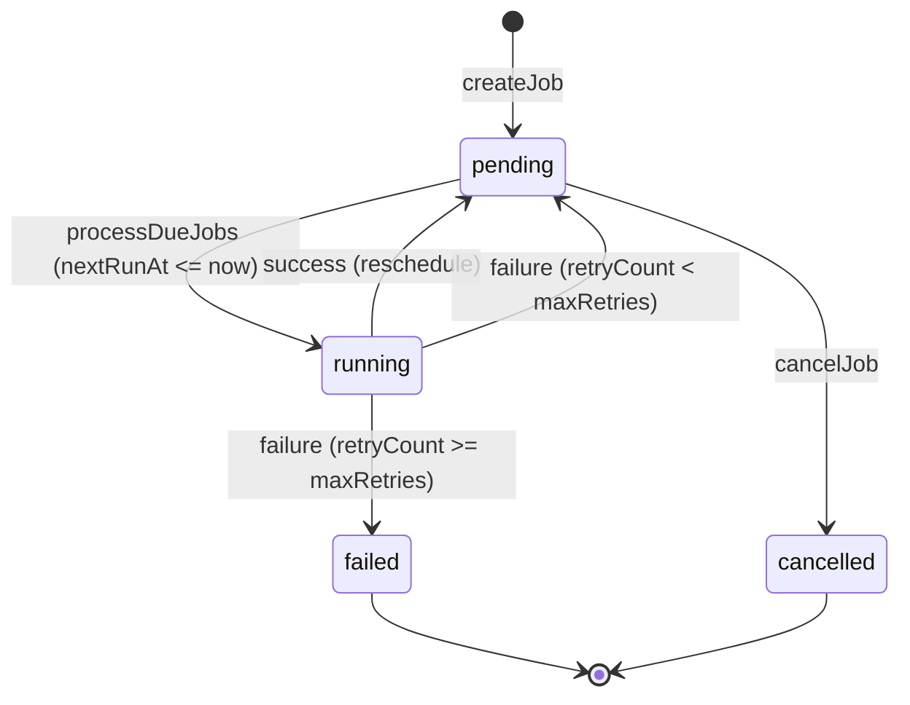

# Jobs and Heartbeat

Expendi provides two mechanisms for work that happens without direct API calls: **Jobber** (scheduled recurring jobs) and **Heartbeat** (reactive condition monitoring). This guide explains both, when to use each, and how to configure them.

## Jobber: Scheduled Jobs

Jobber manages recurring jobs stored in the `jobs` database table. A job fires on a schedule, executes a transaction, and then reschedules itself. If a job fails, it retries up to a configurable maximum.

All job management endpoints are on the **internal admin API** (`/internal/jobs`) and require the `X-Admin-Key` header. Jobs are not accessible through the public API.

### Job lifecycle



### Schedule format

Jobs use a simple duration string for the schedule:

| Format | Meaning | Example |
|--------|---------|---------|
| `{N}s` | Every N seconds | `30s` |
| `{N}m` | Every N minutes | `5m` |
| `{N}h` | Every N hours | `1h` |
| `{N}d` | Every N days | `1d` |

If the format is not recognized, the system defaults to 60 seconds.

### Job types

| `jobType` | What it does |
|-----------|-------------|
| `contract_transaction` | Calls `TransactionService.submitContractTransaction` with the payload fields: `walletId`, `walletType`, `contractName`, `chainId`, `method`, `args`, and optionally `value`. |
| `raw_transaction` | Calls `TransactionService.submitRawTransaction` with the payload fields: `walletId`, `walletType`, `chainId`, `to`, and optionally `data` and `value`. |

Any other `jobType` value is accepted but will not execute any transaction -- the job will simply be marked as processed and rescheduled. This allows you to extend Jobber with custom job types by modifying the `processJob` function.

### Creating a job

```bash
curl -X POST http://localhost:3000/internal/jobs \
  -H "X-Admin-Key: YOUR_ADMIN_API_KEY" \
  -H "Content-Type: application/json" \
  -d '{
    "name": "Hourly ETH sweep",
    "jobType": "raw_transaction",
    "schedule": "1h",
    "payload": {
      "walletId": "source-wallet-id",
      "walletType": "server",
      "chainId": 1,
      "to": "0xTreasuryAddress",
      "value": "100000000000000000"
    },
    "maxRetries": 5
  }'
```

Response:

```json
{
  "success": true,
  "data": {
    "id": "job-uuid",
    "name": "Hourly ETH sweep",
    "jobType": "raw_transaction",
    "schedule": "1h",
    "payload": {
      "walletId": "source-wallet-id",
      "walletType": "server",
      "chainId": 1,
      "to": "0xTreasuryAddress",
      "value": "100000000000000000"
    },
    "status": "pending",
    "lastRunAt": null,
    "nextRunAt": "2025-01-01T01:00:00.000Z",
    "maxRetries": 5,
    "retryCount": 0,
    "error": null,
    "createdAt": "2025-01-01T00:00:00.000Z",
    "updatedAt": "2025-01-01T00:00:00.000Z"
  }
}
```

### Creating a contract transaction job

```bash
curl -X POST http://localhost:3000/internal/jobs \
  -H "X-Admin-Key: YOUR_ADMIN_API_KEY" \
  -H "Content-Type: application/json" \
  -d '{
    "name": "Daily USDC distribution",
    "jobType": "contract_transaction",
    "schedule": "1d",
    "payload": {
      "walletId": "treasury-wallet-id",
      "walletType": "server",
      "contractName": "usdc",
      "chainId": 1,
      "method": "transfer",
      "args": ["0xRecipientAddress", "1000000"]
    }
  }'
```

### Processing due jobs

Jobs do not run automatically by default. You have two options:

**Option A: Manual trigger via API**

```bash
curl -X POST http://localhost:3000/internal/jobs/process \
  -H "X-Admin-Key: YOUR_ADMIN_API_KEY"
```

This finds all jobs with `status = "pending"` and `nextRunAt <= now`, executes them, and returns the list of processed jobs:

```json
{
  "success": true,
  "data": {
    "processedCount": 2,
    "jobs": [ ]
  }
}
```

You can call this from an external cron scheduler (e.g., a cron job, a Kubernetes CronJob, or a GitHub Actions workflow).

**Option B: Built-in polling**

The `JobberService` exposes a `startPolling` method that runs an Effect schedule loop:

```typescript
// In your startup code or a custom layer:
const jobber = yield* JobberService;
yield* jobber.startPolling(30000); // Check every 30 seconds
```

This is a blocking Effect that runs forever. You would typically fork it into a background fiber if you want the server to continue handling requests.

### Managing jobs

**List all jobs:**

```bash
curl http://localhost:3000/internal/jobs \
  -H "X-Admin-Key: YOUR_ADMIN_API_KEY"
```

**Get a specific job:**

```bash
curl http://localhost:3000/internal/jobs/{id} \
  -H "X-Admin-Key: YOUR_ADMIN_API_KEY"
```

**Cancel a job:**

```bash
curl -X POST http://localhost:3000/internal/jobs/{id}/cancel \
  -H "X-Admin-Key: YOUR_ADMIN_API_KEY"
```

This sets the job's status to `"cancelled"`. Cancelled jobs are not picked up by `processDueJobs`.

### Retry behavior

When a job fails:

1. The `retryCount` is incremented.
2. If `retryCount < maxRetries`, the job is set back to `"pending"` (it will be retried on the next `processDueJobs` call).
3. If `retryCount >= maxRetries`, the job is set to `"failed"` permanently.
4. The error message is stored in the `error` column.

The default `maxRetries` is 3 if not specified at creation time.

## Heartbeat: Reactive Condition Monitoring

Heartbeat watches for on-chain and market conditions and executes actions when they trigger. Unlike Jobber (which runs on a fixed schedule), Heartbeat reacts to the current state of the world.

### Condition types

| Type | What it checks | Parameters |
|------|---------------|------------|
| `balance_threshold` | Checks an address's native token balance on a specific chain | `address`, `chainId`, `threshold` (wei string), `direction` (`"below"` or `"above"`) |
| `price_trigger` | Checks a cryptocurrency's USD price via `AdapterService` | `symbol`, `targetPrice` (number), `direction` (`"below"` or `"above"`) |
| `block_event` | Checks for specific smart contract events in recent blocks | `contractAddress`, `chainId`, `eventSignature`, `blockRange` (number of blocks to scan), optional `filterArgs` |

### The HeartbeatCondition shape

```typescript
export interface HeartbeatCondition {
  readonly id: string;                       // Unique identifier for this condition
  readonly type: ConditionType;              // "balance_threshold" | "price_trigger" | "block_event"
  readonly params: Record<string, unknown>;  // Type-specific parameters (see table above)
  readonly action: {
    readonly type: "transaction" | "notification";
    readonly payload: Record<string, unknown>;  // Parameters for the action
  };
  readonly active: boolean;                  // Whether to check this condition
}
```

When a condition is triggered and the action type is `"transaction"`, Heartbeat calls `TransactionService.submitRawTransaction` with the action payload:

```typescript
// Action payload fields for "transaction" type:
{
  walletId: string;
  walletType: "user" | "server" | "agent";
  chainId: number;
  to: `0x${string}`;
  value?: string;  // wei value as a string
}
```

The `"notification"` action type is defined in the interface but does not currently execute any logic. You can extend the `executeAction` function to handle notifications (webhooks, emails, etc.).

### Registering conditions

Heartbeat conditions are managed through the `HeartbeatService` programmatically. There are no REST endpoints for Heartbeat -- you interact with it through the Effect service layer.

**Balance threshold example:** Trigger when a wallet's balance drops below 0.1 ETH.

```typescript
import { HeartbeatService, type HeartbeatCondition } from "./services/heartbeat/heartbeat-service.js";

const condition: HeartbeatCondition = {
  id: "low-balance-alert",
  type: "balance_threshold",
  params: {
    address: "0xYourWalletAddress",
    chainId: 1,
    threshold: "100000000000000000", // 0.1 ETH in wei
    direction: "below",
  },
  action: {
    type: "transaction",
    payload: {
      walletId: "treasury-wallet-id",
      walletType: "server",
      chainId: 1,
      to: "0xYourWalletAddress",
      value: "500000000000000000", // top up with 0.5 ETH
    },
  },
  active: true,
};

// In an Effect context:
const heartbeat = yield* HeartbeatService;
yield* heartbeat.registerCondition(condition);
```

**Price trigger example:** Trigger when ETH drops below $2000.

```typescript
const condition: HeartbeatCondition = {
  id: "eth-price-drop",
  type: "price_trigger",
  params: {
    symbol: "ETH",
    targetPrice: 2000,
    direction: "below",
  },
  action: {
    type: "transaction",
    payload: {
      walletId: "dca-wallet-id",
      walletType: "server",
      chainId: 1,
      to: "0xUniswapRouterAddress",
      value: "1000000000000000000", // Buy 1 ETH worth
    },
  },
  active: true,
};
```

**Block event example:** Trigger when a specific contract emits a `Transfer` event.

```typescript
const condition: HeartbeatCondition = {
  id: "usdc-large-transfer",
  type: "block_event",
  params: {
    contractAddress: "0xA0b86991c6218b36c1d19D4a2e9Eb0cE3606eB48",
    chainId: 1,
    eventSignature: "Transfer(address indexed from, address indexed to, uint256 value)",
    blockRange: 50,
  },
  action: {
    type: "notification",
    payload: { channel: "slack", message: "Large USDC transfer detected" },
  },
  active: true,
};
```

### Running the Heartbeat loop

Like Jobber, Heartbeat does not run automatically. You have two options:

**Manual check:**

```typescript
const heartbeat = yield* HeartbeatService;
const triggeredIds = yield* heartbeat.checkConditions();
// triggeredIds is an array of condition IDs that fired
```

**Continuous polling loop:**

```typescript
const heartbeat = yield* HeartbeatService;
yield* heartbeat.startLoop(60000); // Check every 60 seconds
```

This runs forever as an Effect schedule, checking all active conditions each interval.

### Managing conditions

```typescript
const heartbeat = yield* HeartbeatService;

// List all conditions
const conditions = yield* heartbeat.listConditions();

// Remove a condition
const existed = yield* heartbeat.removeCondition("low-balance-alert");
```

### How condition checks work

For each active condition, the check flow is:

1. Based on the condition `type`, call the appropriate checker (`checkBalanceThreshold`, `checkPriceTrigger`, or `checkBlockEvent`).
2. If the checker throws an error, the condition is treated as not triggered (errors are swallowed with `Effect.catchAll(() => Effect.succeed(false))`).
3. If the checker returns `true`, call `executeAction` for that condition.
4. The condition ID is added to the triggered list.

Conditions are not automatically deactivated after triggering. They will fire again on every poll interval as long as the condition remains true. If you want one-shot behavior, remove the condition in the action handler or set `active: false`.

## Jobber vs. Heartbeat: When to Use Which

| Criterion | Jobber | Heartbeat |
|-----------|--------|-----------|
| **Trigger** | Time-based (fixed schedule) | Condition-based (state of the world) |
| **Storage** | PostgreSQL (`jobs` table) | In-memory (`Ref<Map>`) |
| **Survives restarts** | Yes (persisted) | No (must re-register conditions on startup) |
| **Retry** | Built-in with `maxRetries` | No retry -- condition is re-evaluated next poll |
| **API access** | Internal API (`/internal/jobs`) | Programmatic only (no REST endpoints) |
| **Use case** | Recurring payments, periodic sweeps, daily reports | Balance alerts, price-based DCA, event monitoring |
| **Action type** | Contract or raw transactions | Raw transactions or notifications |

**Use Jobber when** you need a guaranteed recurring action on a fixed schedule, especially if it must survive server restarts.

**Use Heartbeat when** you need to react to external conditions (prices, balances, events) and the action should only happen when the condition is true.

## Combining Jobber and Heartbeat

A common pattern is to use Jobber to trigger `checkConditions` on a schedule, rather than running Heartbeat's own polling loop. This gives you the persistence and retry benefits of Jobber with the condition-checking logic of Heartbeat:

```typescript
// Create a job that triggers Heartbeat checks every 5 minutes
const jobber = yield* JobberService;
const heartbeat = yield* HeartbeatService;

// Register your conditions with Heartbeat...
yield* heartbeat.registerCondition(/* ... */);

// Then use a custom job type to trigger checks
// (requires extending processJob to handle custom types)
```

Alternatively, keep them separate: use Jobber for known scheduled tasks and Heartbeat for reactive monitoring, each with their own polling interval.
